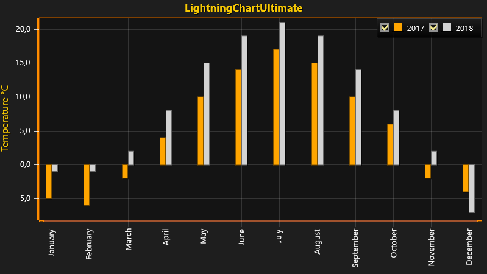

# Simple 2D BarSeries Chart with CustomAxisTicks

This tutorial explains how to create a simple 2D chart with two *BarSeries*.   
*BarSeries* is a representation of data values as rectangle shaped bars and it can be utilized for visualizing differences and variance between datas in a very clear manner.

In this tutorial *BarSeries* is used for representing monthly average temperatures over a two-year period.

The tutorial assumes that you have created a new chart with *LightningChart* on a WinForms or WPF application. If not, please follow our [Simple 2D Chart](https://www.arction.com/tutorials/#/lcu_tutorial_simple2Dchart_01) on creating an application.



##### 1. Create a new BarSeries and add styling for created series.

You can define colors using *System.Windows.Media.Color* or *System.Drawing.Color* depending on whether you are using WPF or WinForms.

```csharp
// Create a new BarSeries.
var barSeries1 = new BarSeries(chart.ViewXY, axisX, axisY);

 // Add styling to created series.
barSeries1.Fill.Color = Color.FromRgb(255, 165, 0); // Orange.
barSeries1.Fill.GradientFill = GradientFill.Solid;
barSeries1.Title.Text = "2017";
barSeries1.BarThickness = 10;
```

##### 2. Generate data as BarSeriesValues to represent average monthly temperatures and add them to BarSeries.

```csharp
// Generate data as BarSeriesValues.
BarSeriesValue[] bars1 = new BarSeriesValue[]
{
    new BarSeriesValue(0, -5, null),
    new BarSeriesValue(1, -6, null),
    new BarSeriesValue(2, -2, null),
    new BarSeriesValue(3, 4, null),
    new BarSeriesValue(4, 10, null),
    new BarSeriesValue(5, 14, null),
    new BarSeriesValue(6, 17, null),
    new BarSeriesValue(7, 15, null),
    new BarSeriesValue(8, 10, null),
    new BarSeriesValue(9, 6, null),
    new BarSeriesValue(10, -2, null),
    new BarSeriesValue(11, -4, null)
};

// Add BarSeriesValues to BarSeries.
barSeries1.Values = bars1;
```

##### 3. Add BarSeries to chart.

```csharp
// Add BarSeries to chart.
chart.ViewXY.BarSeries.Add(barSeries1);
```

##### 4. Create second BarSeries and add styling for created series.

```csharp
 // Create second BarSeries.
var barSeries2 = new BarSeries();

// Add styling to created series.
barSeries2.Fill.Color = Color.FromRgb(211, 211, 211); // LightGray.
barSeries2.Fill.GradientFill = GradientFill.Solid;
barSeries2.Title.Text = "2018";
barSeries2.BarThickness = 10;
```

##### 5. Generate an other set of data as BarSeriesValues to represent average monthly temperatures and add them to BarSeries.

```csharp
BarSeriesValue[] bars2 = new BarSeriesValue[]
{
    new BarSeriesValue(0, -1, null),
    new BarSeriesValue(1, -1, null),
    new BarSeriesValue(2, 2, null),
    new BarSeriesValue(3, 8, null),
    new BarSeriesValue(4, 15, null),
    new BarSeriesValue(5, 19, null),
    new BarSeriesValue(6, 21, null),
    new BarSeriesValue(7, 19, null),
    new BarSeriesValue(8, 14, null),
    new BarSeriesValue(9, 8, null),
    new BarSeriesValue(10, 2, null),
    new BarSeriesValue(11, -7, null)
};

// Add BarSeriesValues to BarSeries.
barSeries2.Values = bars2;
```

##### 6. Add BarSeries to chart.

```csharp
// Add BarSeries to chart.
chart.ViewXY.BarSeries.Add(barSeries2);
```
*LightningChart* offers *BarViewOptions* property for customizing how bars are being displayed on the chart.   
*BarViewOptions.Grouping* allows setting bars to chart by value indices, by indices using width fitting or by location values.

In this tutorial grouping is done using *ByLocation*-option.

##### 7. Configure bar view layout for BarSeries.

```csharp
// Configure bar view layout.
chart.ViewXY.BarViewOptions.Grouping = BarsGrouping.ByLocation;
```

*LightningChart* provides possibility to add your own custom ticks as axis values by using *CustomAxisTicks*.   
In this tutorial *CustomAxisTicks* are used for displaying names of months as X-axis values.

```csharp
// Create list of months.
string[] months = new string[]
{
    "January",
    "February",
    "March",
    "April",
    "May",
    "June",
    "July",
    "August",
    "September",
    "October",
    "November",
    "December"
};

// Create CustomAxisTicks to display months as X-axis values.
for (int i = 0; i < months.Length; i++)
{
    CustomAxisTick tick = new CustomAxisTick(axisX);
    tick.AxisValue = i;
    tick.LabelText = months[i];
    tick.Color = Color.FromArgb(35, 255, 255, 255);

    axisX.CustomTicks.Add(tick);
}

// Notify chart about set custom axis ticks.
axisX.InvalidateCustomTicks();
```

##### Note! In order to show custom axis ticks correctly remember to set AutoFormatLabels  property to false and CustomTicksEnabled property to true.

```csharp
// Disable autoformating of labels.
axisX.AutoFormatLabels = false;

// Enable CustomAxisTicks.
axisX.CustomTicksEnabled = true;
```